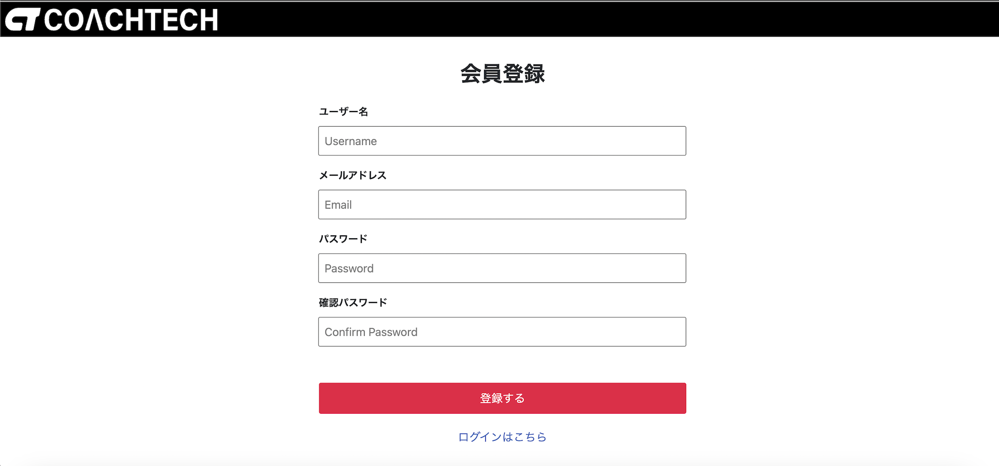

# フリマアプリ　＃fleaMarket

会員登録なしでも閲覧は可能ですが、購入や販売をする場合は会員登録が必要。 
氏名、メールアドレス、パスワードを入力、登録し、そのメールアドレスに届く確認メールを開き、 
メールアドレスとパスワードを入力しログインします。  
 
 

## 作成した目的
普段利用しているアプリは情報量が多くごちゃごちゃと煩雑で見辛い印象がありました。
そのため必要最低限の情報と機能のみで、かつ見やすいページ構成で自分なりのフリマアプリを開発してみました。  

## アプリケーションURL
http://15.168.189.199（現在閲覧不可）

## 機能一覧

#### 管理画面 : ユーザー登録・ログインページ
- [会員登録](http://localhost/register)
- [ログイン](http://localhost/login) 
  ※ メール認証を導入し、安全なログイン・ログアウト機能を提供。 
  ※ さらに、Fortify を導入することで、より強固な認証を実現。

#### 商品情報 : 販売中の商品一覧や詳細
- ログインユーザーは、お気に入りへの追加や購入が可能。

#### ユーザー機能 : マイページで商品管理
- **お気に入り登録** : 気に入った商品をマイリストで一覧管理。
- **購入・出品した商品の表示** : マイページで一覧管理。
- **レビュー投稿** : 購入した商品に対する口コミを投稿し、誰でも閲覧可能。

#### メール機能のテスト
- **MailHog を使用し、ローカル環境でメール送信のテストが可能。**
  - メールの送信内容は、ブラウザで以下の URL から確認できます。
    → [MailHog インターフェース](http://localhost:8025)

#### 決済機能 : Stripeを使用
- 購入時に「クレジットカード決済」と「コンビニ決済」から選択可能。
- クレジット決済はStripeを採用しています。

- **セキュリティ対策:**
  - Stripe の `PUBLIC_KEY`、`SECRET_KEY` は `.env.local`、`.env.prod` に記載。
  - `.env.prod` 内の AWS `ID` と `KEY` も同様に記載。

#### デザイン : レスポンシブ対応
- タブレット・スマートフォン向けに **768px** でレスポンシブデザインを導入。

## 使用技術
  - Laravel Framework :Ver 8.83.29

  - PHP :Ver 8.4.3

  - mysql :Ver 9.2.0

  - HTML、CSS

  - JavaScript

## テーブル設計

## 環境構築　
このプロジェクトをDockerを使用し、ローカルで動作させるための手順です。 
**Dockerビルド**
1. `git clone git@github.com:Otsumu/FleaMarket.git`
2. DockerDesktopアプリを立ち上げる
3. `docker-compose up -d --build` 

**Laravel環境構築**
1. リポジトリのクローン git clone https://github.com/Otsumu/FleaMarket.git 
2. ディレクトリに移動 cd FleaMarket 
3. Dockerコンテナのビルドと起動 docker-compose up --build -d 
4. PHPコンテナ内に入る docker-compose exec php bash 
5. 依存関係のインストール composer install 
6. 環境ファイルの作成 cp .env.example .env 
7. データーベースの設定 nano .env 
8. アプリケーションキーの生成 php artisan key:generate 
9. データーベースのマイグレーション php artisan migrate 
10. シーディングの実行　php artisan db:seed 
11. アプリケーションへのアクセス http://localhost
